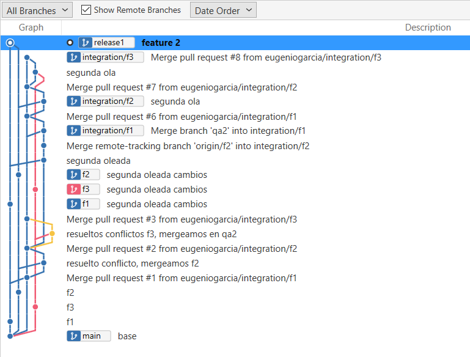
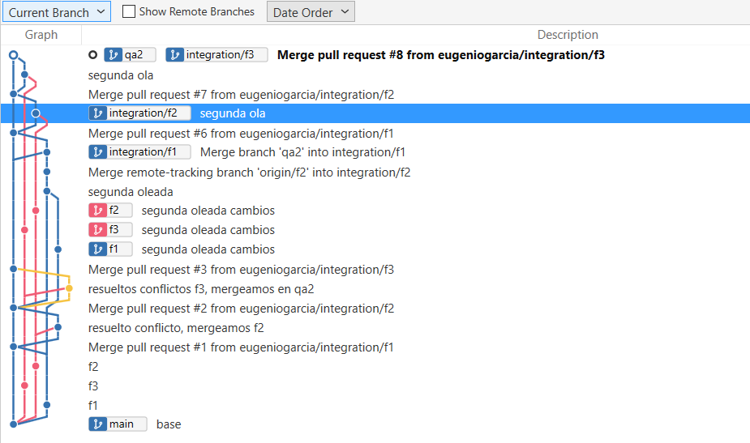
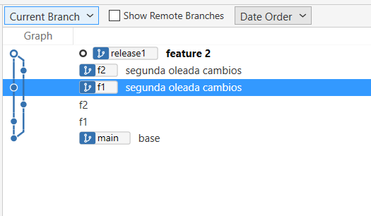

## Inicio

- Creamos tres features, f1, f2 y f3 a partir de main
- qa2 y main estan alineadas
- tocamos f1, f2 y f3

## Mergear origin/f1 en qa2

Para evitar hacer push directo en qa2 (restricciones configuradas en el proveedor de git para hacer unicamente PR en qa2)

```ps
git fetch origin # traemos todo de remoto

git checkout -b integration/f1 origin/qa2 # creamos una rama local llamada integration/f1 sobre origin/qa2

git merge origin/f1 # mergeamos en integration/f1 lo que tengamos en origin/f1. Pueden saltar conflictos

git push origin integration/f1 # llevamos integration/f1 a origin/integration/f1
```

Ahora ya podemos hacer el PR de integration/f1 a qa2 y no saldrán conflictos

```ps
gh pr create --base qa2 --head integration/f1 --title "Incorpora f1 a UATs" --body "Primer despliegue de f1"
```

## Mergear origin/f2 en qa2

Ahora vamos a mergear f2 en qa2

```ps
git fetch origin # traemos todo de remoto

git checkout -b integration/f2 origin/qa2 # creamos una rama local llamada integration/f2 sobre origin/qa2
```

ahora procedemos a hacer el merge de la f2:

```ps
git merge origin/f2 # mergeamos en integration/f2 lo que tengamos en origin/f2

Auto-merging c2.txt
CONFLICT (content): Merge conflict in c2.txt
Automatic merge failed; fix conflicts and then commit the result.
```

nos han saltado conflictos. Recordemos que el checkout lo tenemos en integration/f2.

```ps
git status
On branch integration/f2
Your branch is up to date with 'origin/qa2'.

You have unmerged paths.
  (fix conflicts and run "git commit")
  (use "git merge --abort" to abort the merge)

Changes to be committed:
        modified:   c3.txt

Unmerged paths:
  (use "git add <file>..." to mark resolution)
        both modified:   c2.txt
```

el conflicto lo tenemos en `c2.txt`. Si abrimos este archivo:

```txt
<<<<<<< HEAD
base 1
linea 1
=======
base 2
linea 2
>>>>>>> origin/f2
```

vemos en que consiste el conflicto. En este caso lo vamos a dejar asi:

```txt
base 1 y 2
linea 1
linea 2
```

aceptamos los cambios, hacemos un commit

```ps
git stage .

git commit -m "resuelto conflicto, mergeamos f2"

git push origin integration/f2
```


Ahora ya podemos hacer el PR de integration/f2 a qa2 y no saldrán conflictos

```ps
gh pr create --base qa2 --head integration/f2 --title "Incorpora f2 a UATs" --body "Primer despliegue de f2"
```

## Mergear commits posteriores de origin/f1 a qa2

Hemos continuado haciendo cambios en f1, f2, y f3. Vamos a desplegar estos cambios en qa2

### Despliegue de cambios de f1 en qa2


```ps
git checkout integration/f1

git pull

git merge origin/qa2    # traemos a integration/f1 cualquier cambio que se hubiera hecho en qa2 desde la ultima vez que subimos algo de f1

git merge origin/f1     # incorporamos los cambios de f1
```

en este punto puede haber conflictos en el merge. Los resolvemos como hicimos antes. Una vez resueltos:

```ps
git push origin integration/f1
```

y hacemos el PR:

```ps
gh pr create --base qa2 --head integration/f1 --title "Incorpora fixes f1 a UATs" --body "Segundo despliegue de f1"
```

## Despliegue a Prod

Creamos la rama con la release:

```ps
git checkout -b release1 origin/main

git push -u origin release1
```

mergeamos las features que queremos pasar. Empezamos con la f1:

```ps
git merge origin/f1
```

ahora la f2

```ps
git merge origin/f2

Auto-merging c2.txt
CONFLICT (content): Merge conflict in c2.txt
Auto-merging c3.txt
CONFLICT (content): Merge conflict in c3.txt
Automatic merge failed; fix conflicts and then commit the result.
```

resolvemos los conflictos. Una vez resueltos hacemos el PR de la release

### Auditoria

Podemos ver en este punto las siguientes ramas:

```ps
git fetch origin
```



Si vemos la rama qa2 podemos ver todas las cosas que se han mergeado, incluyendo las dos features f1 y f2



```ps
git branch -r --merged origin/qa2 --sort=-committerdate
  origin/qa2
  origin/integration/f3
  origin/integration/f2
  origin/integration/f1
  origin/f2
  origin/f3
  origin/f1
  origin/HEAD -> origin/main
  origin/main
```

podemos ver los PR hechos en qa2:

```ps
gh pr list --base qa2 --state merged

Showing 6 of 6 pull requests in eugeniogarcia/prueba that match your search

ID  TITLE                      BRANCH          CREATED AT
#8  Incorpora fixes f3 a UATs  integration/f3  about 36 minutes ago
#7  Incorpora fixes f2 a UATs  integration/f2  about 40 minutes ago
#6  Incorpora fixes f1 a UATs  integration/f1  about 48 minutes ago
#3  Incorpora f3 a UATs        integration/f3  about 1 hour ago
#2  Incorpora f2 a UATs        integration/f2  about 1 hour ago
#1  Incorpora f1 a UATs        integration/f1  about 1 hour ago
```

Podemos ver las features incluidas en la release 1:




```ps
git branch -r --merged origin/release1 --sort=-committerdate
  origin/release1
  origin/f2
  origin/f1
  origin/HEAD -> origin/main
  origin/main
```

o especificamente las features:

```ps
git branch -r --merged origin/release1 --sort=-committerdate| Select-String "origin/f"

  origin/f2
  origin/f1
```

### PR a main

```ps
gh pr create --base main --head release1 --title "Release 1" --body "Despliegue de f1 y f2"
```


